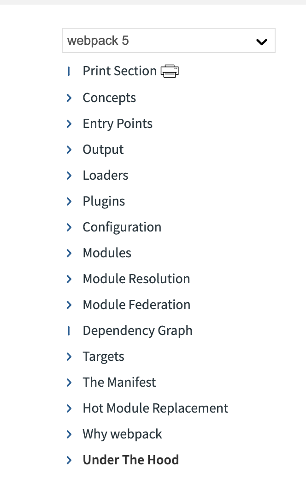

# What is the difference between webpack, Babel and ES-Build?

Webpack is a JavaScript build tool that helps transpiling, configuiring, compiling code and more. It is used in a NodeJS (commonly known as Node) environment. As a side note, naming convention sometimes is upper case. However, like google, webpack is a brand name, I use lower case in these blogs, unless if it is at the start of a sentence.

Webpack is a specialised task runner that takes inputs and produces and output. The inputs are `.js/`,`.html/` `.css` files and the output is browser parseable code. 

The `.html` and `.css` files are processed with plugins as the [documentation on npm](https://www.npmjs.com/package/webpack) describes.

Webpack an open source project that relies on [sponsors](https://webpack.js.org/#sponsors) and programmers who volunteer their time to maintain the programme. 

It is not tied to (and paid by) a big company like some other open source projects, and on the [Webpack github repo](https://github.com/webpack/webpack.js.org) you will find several opportunities to contribute to the maintenance and development of this package. Because of this patchy support, many developers are choosing to use ES-Build.

Webpack is a build tool for frontend development in particular. JavaScript can be read by browsers and does not actually need a build program to run. 

### Some of the key changes that have led to build as a pre-requisite for site hosting

As the size of projects and web-applications grew from 1997, when JavaScript was created by the computer scientist Brendan Eich, the need to have a more performant build process became more apparent. JavaScript was designed to  intercept code and compile it back to what is more performant (a single light file) and it was created as a scripting language.

These are some of the key changes that resulted in the build process becoming a pre-requisite to host JavaScript sites.

- requests for more than just HTML (Hyper Text Markup Language) files - when the the [World Wide Web](https://en.wikipedia.org/wiki/World_Wide_Web), or the Web, was beginning to grow over the internet

- multiple browser request-response cycles in a HTTP (Hyper Text Transfer Protocol)/ XHR (HTTP calls using XML instead of HTML) calls which rose both in frequency and volume

- requests for more than just styling with CSS (Cascading Style Sheets) and other static files - images/ audio/ video

- more pages for websites in the late 1990s - sites becoming larger in terms of content provision

- more computers used by more people

- more devices - not just desktop computers/ laptops/ tablets/ mobile phones/ wearables

It all essentially boils down to - more data/ more big data/ more interconnected big data and file order dependencies (one file depending on another for information). So the pressure to ensure more performant page renders via the process of hydration grew and the faster building of JavaScript files was, and continues to be the ask of the day.

### What happens if you do not build your code before you release it? 

Well, in today's day and age you can only do that if you run HTML, CSS and vanilla JavaScript as your code base. A few static or "brochure" sites can follow this model.

The reality is, with the number of apps, web and mobile plus now with wearable devices, the pressure for more performant page and information loading is only going to increase. 

The biggest distrupter post 2016 was mobile phones, knocking even tablet usage out of the market, but wearables could follow very quickly with watches becoming a key distruptor.

If code runs without a pre-processor or builder the volume of information will not reach the user - what is often termed as "breaking the internet". 

### What are the benefits of webpack?

The key benefits that webpack and many other builders offers are:

- minification of code -> all white spaces are removed and the file sizes are made lighter and therefore quicker/ more performant
- maintain file order dependencies
- keep bugs out of an expensive production
- combine files
- lint out errors (there are specialist linters for React and other libraries and frameworks, the webpack linter performs some basic functions for `.js` files)

Webpack does not solve all these problems and is not a silver bullet. Indeed, webpack being a package in itself, needs maintainence of dependencies and versions.

Webpack today (2024) has fallen out of favour, with many applications moving to ES-Build which is more performant.

### What are the features of Webpack the latest v5?

Webpack v1 was the first version of the build tool but webpack v2 now has other features that have been released to keep pace with change. Key features of webpack are the same, the execution of the code to bundle JavaScript may vary from version to version. 

Packages, like webpack are updated frequently.

While the main release of webpack v5 was in 2018, every major version may have small updates which can be discovered in the `node_modules` files or in a `package.json` file if your repo depends only on webpack. The updates may be shims, or polyfills - which are patches of code performing certain tasks to improve the code execution - and may be minor not causing any changes from previous version to break. 

Major versions, however, can and do have breaking changes which may require developers to go back to the drawing board and update old versions or review the documentation to fix code that breaks because the repo is either directly, or indirectly, dependent on a package like webpack.

At the time of writing (2024) the main version of webpack is v5, the details in the official documentation [webpack version 5](https://webpack.js.org/blog/2020-10-10-webpack-5-release/).

While the functionality of Webpack v5 may have specific breaking changes from v4, webpack has all the functionality of a good bundling package outlined in Part2 of this series which discusses the generic ways in which bundlers offer better functionality for code bundling. This is a screen grab from the v5 home page.

It is worth noting that webpack works with `npm` not Bower and like all packages are a work in progress, so v5 could be updated and future breaking changes are possible.

With all packages, it is important to keep an eye on changes and modify your code base if required.

### What is the difference between Babel and Webpack?

Webpack is mainly a JavaScript bundler for ES6 modules. Babel is mainly a transpiler. Babel and webpack are often used together. In the next section I review Babel in a little more detail.

## What is Babel?

As a short recap, for many years there was no innovation on JavaScript code. This made it almost obsolete. The first version of JavaScript - ES1 - was written by Netscape's, Brenden Eich, in 1997 apocraphally in 10-days.

As the the browser wars broke out every computer manufacturer wanted their own browser and the race to grab a share of the browser market led to some rapid updates ES2 - 1998, ES3 - 1999 and then a long lull ES5 - 2009 and the more standardised version ES6- 2015 with ES13 (current-2022).

With The European Computer Manufacturers' Association, [ECMA's](https://en.wikipedia.org/wiki/Ecma_International), intervention, JavaScript now is maintained and updated regularly. Early modules of JavaScript still run on the [World Wide Web](https://en.wikipedia.org/wiki/World_Wide_Web), or the Web, and newer modules need to be transpiled so that there is uniformity over the code base for browsers to parse(read/ understand) the code.

There are over 100 languages that are transpiled back into JavaScript today. TypeScript and Babel are 2 popular transpilers, although TypeScript is a superscript of JavaScript, it has to be transpiled back into JavaScript and the older versions that browsers can read. TypeScript's main function is to make JavaScript, which is loosely typed, into a strongly-typed version or super-script. Babel, on the other hand, is primarily a transpiler.

In Part1, Part2 and Part3 of this series some of the core concepts behind code modularisation, bundling, compiling and transpiling are discussed in more detail. In brief, computer code has to be chunked into smaller bundles, compiled together and then converted or transpiled from the more modern versions to the older versions browsers can read.

Created by an Australian software developer, Sebastian McEnzie, Babel, is a transpiler that tanspiles ES5 to ES13 to older verisons.

You can think of Babel as a translator. Versions of JavaScript above ES6 offers developers easier and simpler syntax to write code. They can improve efficieny but the trade-off is that due to the fragmentation of the browser market and lack of will to standarise browser parsing of JavaScript, these features are unrecognizable in modern day browsers.

To find a balance between compatibility and development convenience and efficiency, Babel was developed and has been widely adopted by package builders and managers.

Programmers can now write code with the syntatical sugar, that ES6 and later versions of JavaScript offer, and then use Babel to translate them into code that browsers can understand.

Syntactical sugar is syntax added to a code that makes it easy to work with, transpiling with tools such as Babel, reverses this process and makes the process more basic for binary computation and machine-readable code.

### Other options to Babel as a JavaScript transpiler

Babel is not the only JavaScript transpiler in the market. It is a polyfill, which a code-patch or shim.

[Kangex](https://kangax.github.io/compat-table/es6/) is a resource that allows you to check all polyfills, shims and libraries for browser compatiblity. Babel ranks better than most other libraries and packages compared to other shims on this list.

[Browserstack](https://www.browserstack.com/) - gives you a  list.

Other transpilers are google's Traceur - this is an experimental transpiler and not as feature-rich as Babel.

TypeScript has a transpiler and sometimes is compared to Babel but it is a language - a superscript of JavaScript. The primary function of TypeScript is to transpile TypeScript to JavaScript, it happens to have a transpiler but that is not its core function. Babel is not a language, its core function is transpiling.

Babel, itself is is made up of several Node (a short version for NodeJS, a JavaScript run-time environment) packages. In Part2 you can see a brief explanation of npm - Node Package Manager - and Node. To paraphrase, NodeJs packages code into programs and these pre-packaged libraries are available on npm.

It is a pattern you will see in many libraries. For example, Babel which is now in Version 6 of its package-management lifecycle, has baked in 2 key libraries (amongst others) - `babel-core` and `babel-cli` it has further plugins, transformers, task runners, presets. These have to be configured in a dotfile - `.babelrc` in the root of a project with presets depending on how you use Babel.

## What is ES-Build?

ES-Build is another code builder, compiler and transpiler. It uses `go` as a base language and uses ES6 JavaScript modules parsing them on the fly.

Webpack and Babel, reduce JavaScript files to the base CommonJS for browsers to parse. This is an additional step.

Code is bundled in 3 phases - parsing, linking, and code generation. The linking happens by hooking into code modules with the import-export key words without transpiling them. Only in the third phase is the code transpiled.

This makes the build process more performant.
